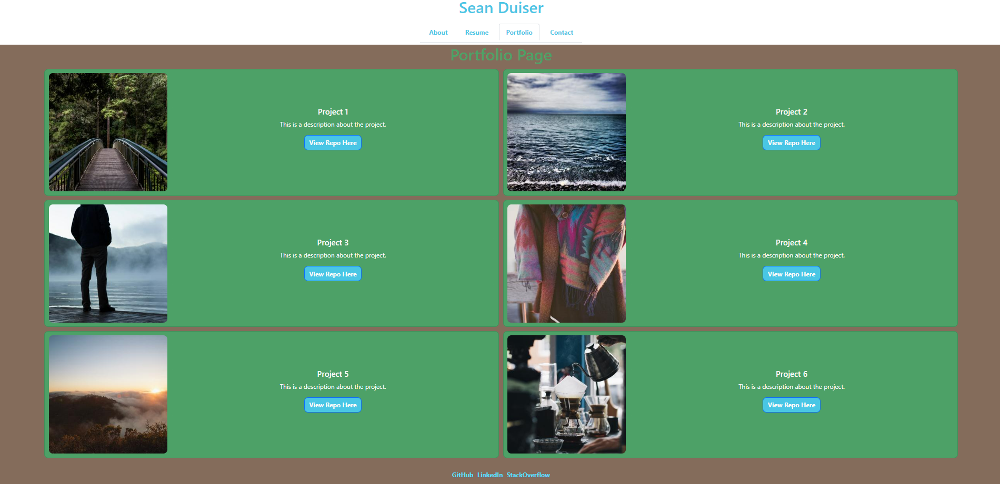

# Seans-React-Portfolio

## Description

Looking For Good Grades was created as an an easy-to-use portal for users to get together and arrange study groups related to different programming languages. It uses an API-style configuration in order to allow a user to create and login to an account. Once a user is logged in they can navigate the site in order to post a study session or view other members session details. Along with creating a session, a commenting system exists in order to post specific comments regarding a particular session. These comment posts can also be modified or deleted. Specific elements such as meetup location along with study dates and times can all be addressed through LFGG.

## Table of Contents

- [Description](#description)

- [Usage](#usage)

- [Screenshots](#screenshots)

- [Contributors](#contributors)

- [Technology](#technology)

- [Links](#links)

## Usage

This page is intended to provide any curious parties with an insight into my skills as a developer. The user can navigate between different pages to learn more about me, view projects, reach out to me personally, and/or download a copy of my resume.

## Screenshots

## Contributors
[Sean Duiser GitHub Link](https://github.com/Sean-Duiser).

## Technology
This application uses React to piece together multiple componentents, utilities, and assets to create an intuitive and elegant portfolio page. Bootstrap was ued to perform certain CSS tasks, while React styling was used for the rest.

## Links
[Deployed Link](https://sean-duiser.github.io/seans-react-portfolio/).
 
[GitHub Link](https://github.com/Sean-Duiser/seans-react-portfolio).
    
[Back To Top](#description)